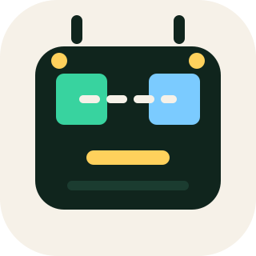
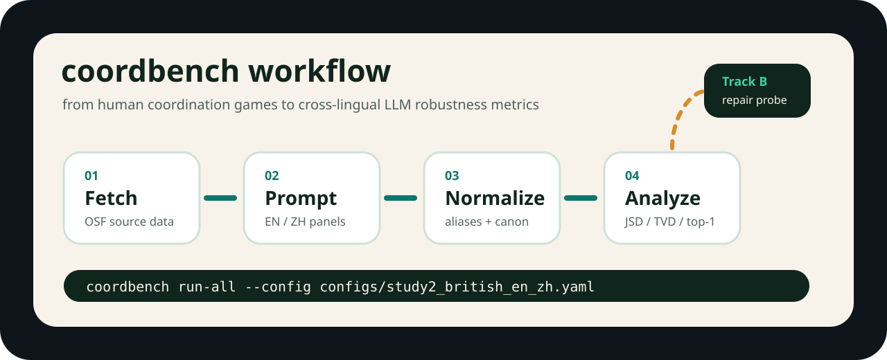

<p align="center">
  
</p>

<h1 align="center">coordbench</h1>

<p align="center">
  <strong>A reproducible benchmark pipeline for cross-lingual tacit coordination in LLMs.</strong><br>
  Human coordination data, EN/ZH prompting, answer normalization, and robustness metrics in one auditable workflow.
</p>

<p align="center">
  <a href="README.md">中文</a>
  ·
  <a href="https://github.com/JY0xLU/coordbench">GitHub</a>
  ·
  <a href="https://osf.io/fv47d/">OSF source data</a>
</p>

<p align="center">
  <a href="https://github.com/JY0xLU/coordbench/stargazers"></a>
  <a href="https://github.com/JY0xLU/coordbench/network/members"></a>
  
  
  
  <a href="LICENSE"></a>
  
</p>

<p align="center">
  
</p>

## What It Is

Most LLM benchmarks ask whether a model gives the correct answer. Coordination games are trickier: when there is no single correct answer, can a model guess the answer that a target group would naturally coordinate on?

`coordbench` studies that question with a narrow, reproducible setup: EN/ZH matched prompts, human-reference distributions, model answer normalization, cross-lingual consistency metrics, and repair-oriented Track B experiments.

It is not just a one-off notebook. It is a pipeline you can rerun, inspect, extend, and argue with. Gently, preferably. :)

## Features

| Module | Purpose |
| --- | --- |
| Source data | Fetch public OSF data and create source snapshots |
| Human panels | Prepare benchmark-ready human panels and distributions |
| Bilingual sampling | Run EN/ZH matched prompts with fixed answer language |
| Normalization | Map model outputs through canonical answers, aliases, and folded surface forms |
| Dual metrics | Separate cross-lingual coordination from human alignment |
| Round 2 | Generate re-coordination candidates from mismatch triggers |
| Track B | Flag, diagnose, repair/sham resample, re-normalize, re-analyze, and report |

## Quick Start

```bash
git clone https://github.com/JY0xLU/coordbench.git
cd coordbench
pip install -e .[dev]
```

Create `.env` from `.env.example` and fill the providers you need:

```text
OPENAI_API_KEY=...
OPENAI_MODEL=...
GEMINI_API_KEY=...
GEMINI_MODEL=...
DEEPSEEK_API_KEY=...
DEEPSEEK_MODEL=...
ANTHROPIC_AUTH_TOKEN=...
ANTHROPIC_BASE_URL=...
ANTHROPIC_MODEL=...
```

Run the default EN/ZH benchmark:

```bash
coordbench run-all --config configs/study2_british_en_zh.yaml
```

## Core CLI

```bash
coordbench fetch-source-data
coordbench prepare-human-panels
coordbench profile-dataset
coordbench run-sampling --config configs/study2_british_en_zh.yaml
coordbench normalize --config configs/study2_british_en_zh.yaml --run-id <run_id>
coordbench analyze --config configs/study2_british_en_zh.yaml --run-id <run_id>
coordbench plot --config configs/study2_british_en_zh.yaml --run-id <run_id>
coordbench run-all --config configs/study2_british_en_zh.yaml
```

Standard workflow:

```text
fetch-source-data -> prepare-human-panels -> profile-dataset
-> run-sampling -> normalize -> analyze -> plot
```

## Track B

Track B lives under `Agent/`. Given a baseline run that has already completed `normalize + analyze`, it performs:

```text
flag -> LLM diagnosis -> repair/sham resampling -> normalize -> analyze -> report
```

Install the Agent package:

```bash
pip install -e Agent
```

Run Track B:

```bash
coordbench track-b run \
  --config configs/study2_british_en_zh.yaml \
  --baseline-run <run_id_or_path>
```

Use stub diagnoses when you only want to test the workflow:

```bash
coordbench track-b run \
  --config configs/study2_british_en_zh.yaml \
  --baseline-run <run_id> \
  --stub-diagnose
```

Progress logs look like `[Track B] phase i/6 ... | overall xx%`. If the run goes quiet for a bit, it may simply be waiting for a model API response.

## Repository Layout

| Path | Contents |
| --- | --- |
| `src/coordbench/` | Main benchmark package and CLI |
| `Agent/` | Track B agent / repair pipeline |
| `configs/` | Benchmark, provider, and sampling configs |
| `data/` | Source data, aliases, and prepared panels |
| `scripts/` | Long-run experiment scripts and monitors |
| `tests/` | Unit and integration tests |
| `docs/` | Data risks, proposal notes, and update logs |
| `results/` | Curated experiment outputs |

## Output Layout

Prepared data:

```text
data/prepared/<snapshot_id>/
```

Run artifacts:

```text
artifacts/runs/<run_id>/
```

Common artifacts include `raw_generations.jsonl`, `normalized_outputs.csv`, `item_metrics.csv`, `summary_metrics.json`, `bootstrap_intervals.csv`, `round2_candidates.csv`, and `plots/`.

## Method Notes

Defaults:

- Panel: `study2_british_within`
- Prompt languages: `en`, `zh`
- Answer language: `English`
- Normalization: `allow_unmapped: false`
- Round-2 triggers: `cross_lingual_top1_mismatch`, `human_top1_mismatch`, `either_top1_mismatch`

Metric tracks:

- Cross-lingual coordination uses `coord_answer_key` to ask whether a model converges to the same answer under different prompt languages.
- Human alignment uses human-mapped `canonical_answer` to ask whether model answers match human reference distributions.

## Development

```bash
pytest -q
python -m coordbench --help
coordbench --help
```

## Source Data

- OSF project: https://osf.io/fv47d/
- Perez-Zapata et al., *Three International Studies on Pure Coordination Games*

## Star History

<a href="https://www.star-history.com/#JY0xLU/coordbench&Date">
  <picture>
    <source media="(prefers-color-scheme: dark)" srcset="https://api.star-history.com/svg?repos=JY0xLU/coordbench&type=Date&theme=dark" />
    <source media="(prefers-color-scheme: light)" srcset="https://api.star-history.com/svg?repos=JY0xLU/coordbench&type=Date" />
    
  </picture>
</a>
