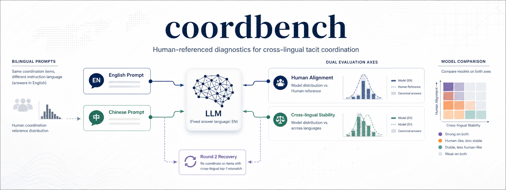
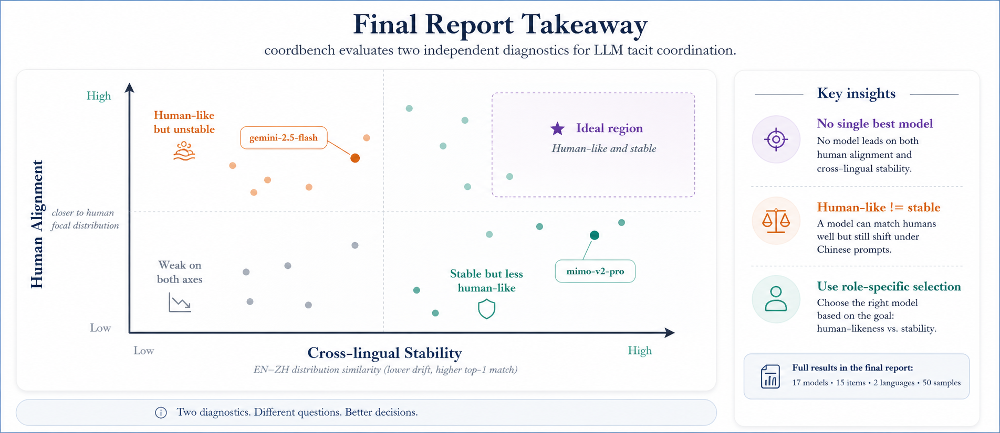
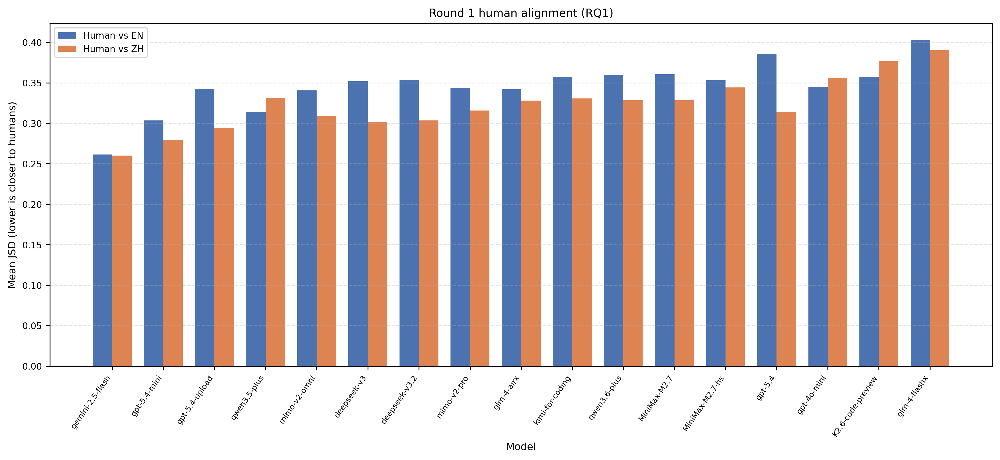
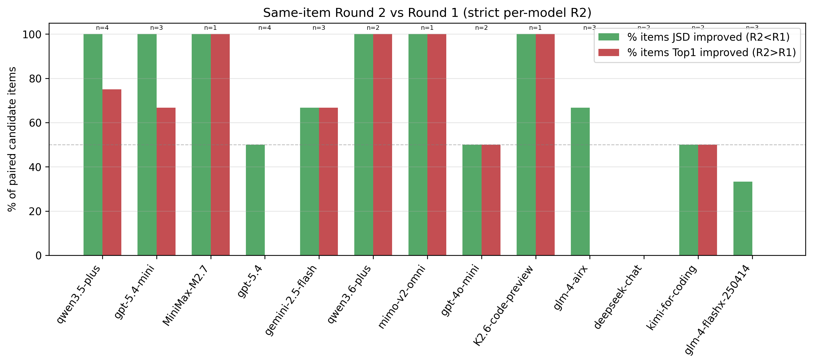
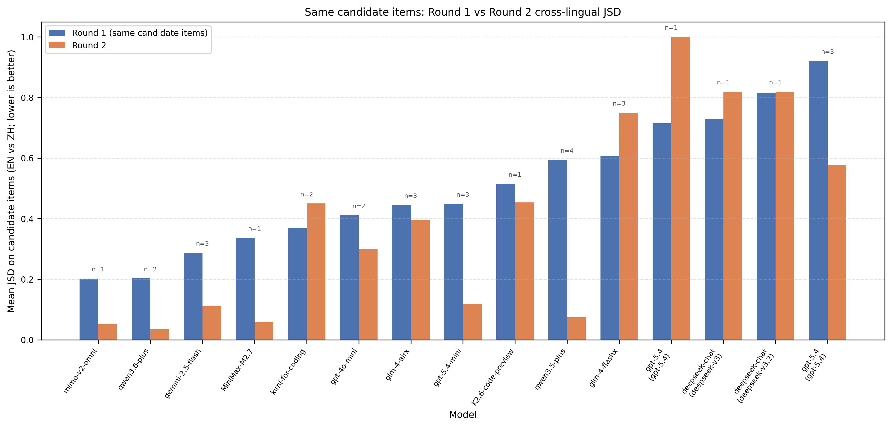

<p align="center">
  
</p>

<h1 align="center">coordbench</h1>

<p align="center">
  <strong>一个用于评估 LLM 跨语言默契协调能力的可复现 benchmark 管线。</strong><br>
  用人类协调游戏分布、英中双语提示、答案归一化和双轨指标，诊断模型是否真的能保持“默契”。
</p>

<p align="center">
  <a href="README.en.md">English</a>
  ·
  <a href="https://github.com/JY0xLU/coordbench">GitHub</a>
  ·
  <a href="https://osf.io/fv47d/">OSF source data</a>
</p>

<p align="center">
  <a href="https://github.com/JY0xLU/coordbench/stargazers"></a>
  <a href="https://github.com/JY0xLU/coordbench/network/members"></a>
  
  
  
  <a href="LICENSE"></a>
  
</p>

## 为什么需要 CoordBench

很多 LLM benchmark 关心“答得对不对”。但 tacit coordination games 更微妙：当没有唯一正确答案时，模型能不能猜到目标群体最可能共同选择的那个默认答案？

例如，让两个人在不能交流的情况下各自“说出一个城市”。评估重点不是有没有标准答案，而是谁能预判对方、群体或文化语境里最显著的 focal point。对 LLM 来说，这类能力会影响多智能体协作、多语言产品界面、默认推荐、工具路由和人机协同中的“默认选择”。

`coordbench` 把这个问题做成可复现实验管线：同一组协调题分别使用 English prompt 和 Chinese prompt，同时把答案语言固定为 English，最后分别衡量模型是否像人类、是否跨语言稳定。

## 研究问题

| 问题 | 评估目标 | CoordBench 如何回答 |
| --- | --- | --- |
| RQ1 | Human alignment | 模型输出分布和人类 focal-point 分布有多接近？ |
| RQ2 | Cross-lingual stability | 同一模型只换提示语言后，EN/ZH 输出分布是否保持一致？ |
| RQ3 | Round 2 recovery | 对 Round 1 发生 top-1 mismatch 的题目，轻量 retry 能否恢复一致性？ |

## 最终报告结论

最终分析在 `study2_british_within` panel 上评估了 **17 个 Round 1 model runs**，每个完整 run 使用 **15 items x 2 prompt languages x 50 samples**。

- **没有一个模型同时赢下两条轴。** `mimo-v2-pro` 跨语言最稳定，`gemini-2.5-flash` 最接近人类参考分布。
- **像人类和跨语言稳定不是同一种能力。** 一个模型可以 EN/ZH 很稳定，但离 human focal distribution 很远；也可以在某种提示语言下像人类，但换语言后 focal answer 发生漂移。
- **Round 2 有帮助，但不均匀。** 在 flagged mismatch items 上，Round 2 恢复了 **14/31** 个 item-model pair 的 top-1 agreement，并降低了 **21/31** 个 pair 的 JSD。
- **最终报告修正了早期 PPT 的小数点错误。** `mimo-v2-pro` 的 mean cross-lingual JSD 是 `0.020`，不是 `0.20`。

<p align="center">
  
</p>

## Benchmark Design

<p align="center">
  
</p>

核心设计是：同一组协调题分别使用 English prompt 和 Chinese prompt，但两边都要求模型用 English 作答。这样 EN/ZH 输出分布可以落在同一个 canonical answer space 里比较，避免把“提示语言变化”和“输出语言变化”混在一起。

1. **Source data**：从 Perez-Zapata et al. 的 OSF 公开材料重建 human coordination panels。
2. **Panel selection**：最终报告使用 `study2_british_within`，包含 15 个 pure coordination items。
3. **Bilingual prompting**：为每个 item 构造 EN/ZH 匹配提示，固定 answer language 为 English。
4. **Sampling**：每个完整 Round 1 model run 对每个 item、每种 prompt language 采样 50 次。
5. **Normalization**：把开放式模型输出映射到 manually verified canonical answers 和 alias table。
6. **Metrics**：分别计算 Human-vs-model 和 EN-vs-ZH 两条轨道的 JSD、TVD、top-1 match、flip rate 和 Spearman。
7. **Round 2**：只对 Round 1 cross-lingual top-1 mismatch 的候选题做轻量 retry。

## 结果图

### Round 1: Cross-lingual Stability

<p align="center">
  
</p>

左图的 JSD 越低，表示 EN/ZH 分布越接近；右图 top-1 match 越高，表示两种提示语言更常选出同一个最高频答案。`mimo-v2-pro`、`mimo-v2-omni` 和 MiniMax M2.7 系列属于稳定层；`qwen3.5-plus`、`gpt-5.4`、`glm-4-flashx` 的语言漂移更明显。

### Round 1: Human Alignment

<p align="center">
  
</p>

Human-alignment JSD 比较的是模型输出分布和同一组 British-within human reference distribution。`gemini-2.5-flash` 在 EN/ZH 两种条件下都最接近人类，但它并不是跨语言最稳定的模型。

### Round 2: Recovery Diagnostics

<p align="center">
  
</p>

<p align="center">
  
</p>

Round 2 是针对每个模型自己的 mismatch candidate items 做轻量重试。它经常能降低分布漂移，但并不能稳定恢复所有模型的 top answer。

## 核心能力

| 模块 | 做什么 |
| --- | --- |
| 数据获取 | 从 OSF 项目拉取公开源数据，并生成 source snapshot |
| 人类 panel | 重建 benchmark-ready human panels、分布和题目清单 |
| 双语采样 | 支持 EN / ZH 匹配提示，并固定 answer language |
| 答案归一化 | 结合 canonical answer、alias、大小写/空格/标点折叠处理模型输出 |
| 双轨指标 | 分开计算 human alignment 和 cross-lingual stability |
| Round 2 | 根据 mismatch 候选题生成二轮 re-coordination |
| Track B | 对 baseline run 自动 flag、诊断、repair/sham 重采样并生成报告 |

## 快速开始

```bash
git clone https://github.com/JY0xLU/coordbench.git
cd coordbench
pip install -e .[dev]
```

从 `.env.example` 创建 `.env`，按需填入模型 provider：

```text
OPENAI_API_KEY=...
OPENAI_MODEL=...
GEMINI_API_KEY=...
GEMINI_MODEL=...
DEEPSEEK_API_KEY=...
DEEPSEEK_MODEL=...
ANTHROPIC_AUTH_TOKEN=...
ANTHROPIC_BASE_URL=...
ANTHROPIC_MODEL=...
```

运行默认英中 benchmark：

```bash
coordbench run-all --config configs/study2_british_en_zh.yaml
```

## 常用命令

```bash
coordbench fetch-source-data
coordbench prepare-human-panels
coordbench profile-dataset
coordbench run-sampling --config configs/study2_british_en_zh.yaml
coordbench normalize --config configs/study2_british_en_zh.yaml --run-id <run_id>
coordbench analyze --config configs/study2_british_en_zh.yaml --run-id <run_id>
coordbench plot --config configs/study2_british_en_zh.yaml --run-id <run_id>
coordbench run-all --config configs/study2_british_en_zh.yaml
```

## 复现最终报告

普通 quick start 使用当前默认 config；最终报告使用 curated 50-sample runs 和最终图表导出。复现时建议按这个顺序核对：

1. 使用 `configs/study2_british_en_zh.yaml` 确认 panel、prompt languages、answer language 和 normalization 设置。
2. 运行或收集每个模型的 Round 1 outputs：`raw_generations.jsonl`、`normalized_outputs.csv`、`item_metrics.csv`、`summary_metrics.json`。
3. 使用 `round2_candidates.csv` 对 Round 1 cross-lingual top-1 mismatch items 做 Round 2 retry。
4. 用 `tools/` 和 `scripts/` 下的聚合/绘图脚本生成最终 tables 和 figures。
5. 对照 README 中的四张结果图确认：RQ1、RQ2、RQ3 不被合并成单一 leaderboard。

## 输出结构

Prepared data 通常位于 `data/prepared/<snapshot_id>/`：

- `panel_items.csv`：benchmark items、prompt text、panel metadata 和语言版本。
- `participant_responses.csv`：清洗后的人类逐条回答。
- `human_distributions.csv`：聚合后的人类 focal-point 分布，也是 human-alignment 参考。
- `panel_summary.csv`、`dataset_inventory.json`、`selection_report.md`、`benchmark_manifest.json`：审计和复现辅助文件。

Run artifacts 通常位于 `artifacts/runs/<run_id>/`：

- `raw_generations.jsonl`：模型原始回答。
- `normalized_outputs.csv`：canonical answer 归一化结果。
- `item_metrics.csv`：item-level JSD、TVD、top-1 match、flip rate、Spearman。
- `summary_metrics.json`：model-level 汇总指标。
- `round2_candidates.csv`：Round 2 候选题。
- `plots/`：生成的分析图。

## 仓库结构

```text
src/coordbench/      Python package 和 CLI 实现
configs/             benchmark/provider YAML 配置
data/                source 和 prepared human-panel 数据
artifacts/           run outputs、cache、logs、plots
results/             curated results 和历史报告
scripts/             experiment runners 和监控脚本
tools/               聚合、绘图等一次性工具
tests/               unit/integration tests
assets/              README logo、流程图和结果图
```

## 测试

```bash
pytest -q
```

## 数据来源

- OSF project: <https://osf.io/fv47d/>
- Human coordination source: Perez-Zapata et al., *Three International Studies on Pure Coordination Games*

